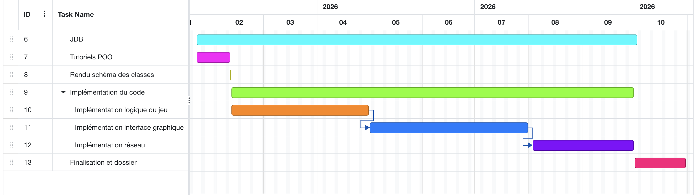

# Echelle temporelle

Voici les échéances principales à garder en tête pour le développement de ce projet :

## Programmation orientée objets 

[Slides d'introduction à la POO](./ressources/introduction.pdf)

[Le rectangle (fichier Python)](./ressources/rectangle.py)

### Ressources extra

- [Tutoriel](https://www.datacamp.com/fr/tutorial/python-oop-tutorial?) sur la création de classes et instanciation d'objets.

- [Vidéo d'introduction](https://www.youtube.com/watch?v=h6jciR8K43E) avec focus sur le constructeur .

## Model - View - Controller

Work in progress
