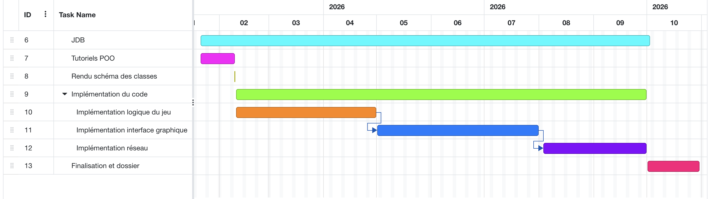

# Echelle temporelle

Voici les échéances principales à garder en tête pour le développement de ce projet :

## Programmation orientée objets 

[Slides d'introduction à la POO](./ressources/introduction.pdf)

[Le rectangle (fichier Python)](./ressources/rectangle.py)

### Ressources extra

- [Tutoriel](https://www.datacamp.com/fr/tutorial/python-oop-tutorial?) sur la création de classes et instanciation d'objets.

- [Vidéo d'introduction](https://www.youtube.com/watch?v=h6jciR8K43E) avec focus sur le constructeur.

- [Exercices d'entraînement](https://mcoilhac.forge.apps.education.fr/term/POO/5_exos_POO/), notamment le 6 et le 7, qui utilisent plusieurs classes.

## Interface graphique avec NiceGUI

[Slides d'introduction](./ressources/interface/Intro-niceGUI.pdf) à l'interface graphique et réseau

[Exemple](./ressources/interface/code/) présenté en classe avec les différentes versions

### Tutoriels, documentation et liens utiles:

- [Playlist](https://www.youtube.com/watch?v=8ThvEe9Ym5c&list=PLMi6KgK4_mk1xZc45zEBxlByLhpbJK2Uy) de tutoriels YouTube, divisés par argument. Passe très bien en vitesse 1.5.

- Encore deux tutoriels textuels plutôt bien faits: [tutoriel 1](https://www.pythonguis.com/tutorials/getting-started-nicegui/) et [tutoriel 2](https://www.geeksforgeeks.org/python/introduction-to-nicegui-a-python-based-ui-framework/).

- [Exemples](https://nicegui.io/examples)de composantes déjà prêtes, pas très orienté jeu, mais riche.
